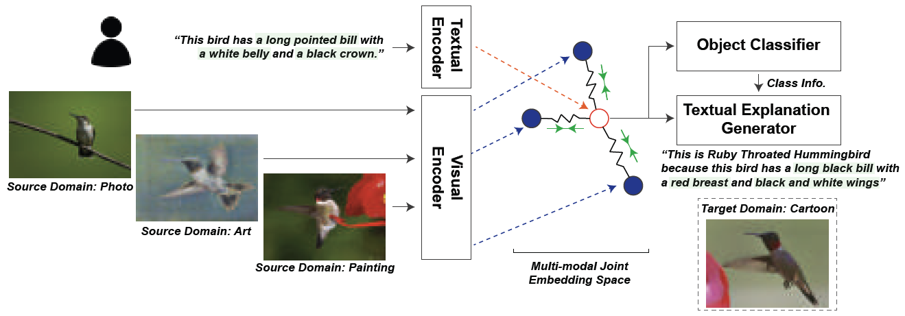
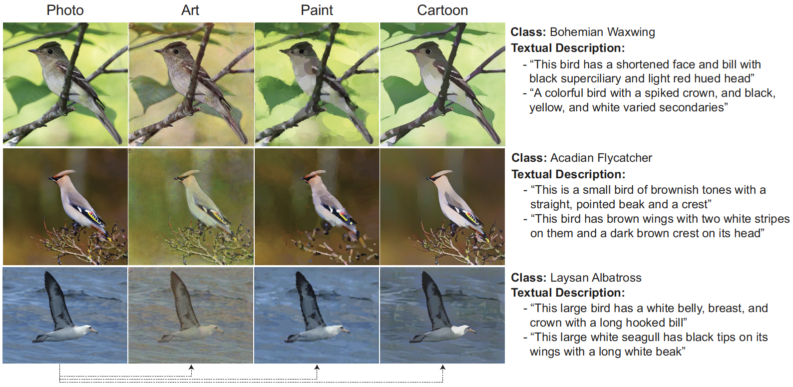

# Grounding Visual Representations with Texts (GVRT)
[**Grounding Visual Representations with Texts for Domain Generalization**](https://github.com/mswzeus/GVRT) \
Seonwoo Min, Nokyung Park, Siwon Kim, Seunghyun Park, Jinkyu Kim \
ECCV 2022 | Official Pytorch implementation

***We advocate for leveraging the vision-and-language cross-modality for the domain generalization task.***
- Two modules to ground visual representations with texts containing typical reasoning of humans.
- ***Visual and Textual Joint Embedder*** aligns visual representations with the pivot sentence embedding.
- ***Textual Explanation Generator*** generates explanations justifying the rationale behind its decision.
- Our method achieves state-of-the-art results both in CUB-DG and DomainBed benchmarks!




## Installation
We recommend creating a conda environment and installing the necessary python packages as:
```
git clone https://github.com/mswzeus/GVRT.git
cd GVRT
ln -s ../src DomainBed_GVRT/src
conda create -n GVRT python=3.8
conda activate GVRT
conda install pytorch==1.10.2 torchvision==0.11.3 cudatoolkit=11.3 -c pytorch -c conda-forge
pip install -r requirements.txt
```


## CUB-DG Benchmark Dataset
We created CUB-DG to investivate the cross-modality supervision in the DG task (<a href="https://drive.google.com/file/d/1BU8Jy0a1mdNCbIpUUBrQPqQfNXGXfm1f/view?usp=sharing">Download Link</a>). \
CUB is an image dataset with photos of 200 bird species. For more information, please see the <a href="http://www.vision.caltech.edu/visipedia/CUB-200.html">original repo</a>. \
We used pre-trained style transfer models to obtain images from three other domains, i.e. Art, Paint, and Cartoon.
- Photo-to-Art: <a href="https://github.com/junyanz/pytorch-CycleGAN-and-pix2pix">CycleGAN (Monet)</a>
- Photo-to-Paint: <a href="https://github.com/jiupinjia/stylized-neural-painting">Stylized-Neral-Painting (Watercolor)</a>
- Photo-to-Cartoon: <a href="https://github.com/SystemErrorWang/White-box-Cartoonization">White-Box-Cartoonization model</a>




## Pre-trained Models
We provide the following pre-trained models for three independent runs (<a href="https://drive.google.com/file/d/11CbVRWlSHWd2HPkBkp2ZanUVBFFau8Dx/view?usp=sharing">Download Link</a>). 
- Ours trained with PTE (pre-trained textual encoder)
- Ours trained with STE (self-supervised textual encoder)


## How to Run
### Training a GVRT model
You can use the <code>train_model.py</code> script with the necessary configurations as:
```
CUDA_VISIBLE_DEVICES=0 python train_model.py --algorithm GVRT --test-env 0 --seed 0 --output-path results/PTE_test0_seed0 
```

### Evaluating a GVRT model
You can use the <code>evaluate_model.py</code> script with the necessary configurations as:
```
CUDA_VISIBLE_DEVICES=0 python evaluate_model.py --algorithm GVRT --test-env 0 --seed 0 --output-path results/PTE_test0_seed0 --checkpoint pretrained_models/PTE_test0_seed0.pt
```


## Experimental Results on CUB-DG
We report averaged results across three independent runs.


## Citation
If you find our work useful, please kindly cite this paper:
```bib
@article{min2022grounding,
  author    = {Seonwoo Min and Nokyung Park and Siwon Kim and Seunghyun Park and Jinkyu Kim},
  title     = {Grounding Visual Representations with Texts for Domain Generalization},
  journal   = {Preprint},
  year      = {2022},
}
```